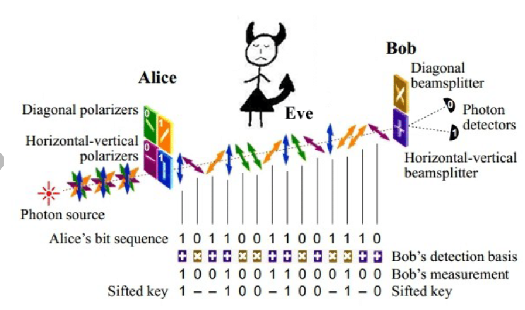
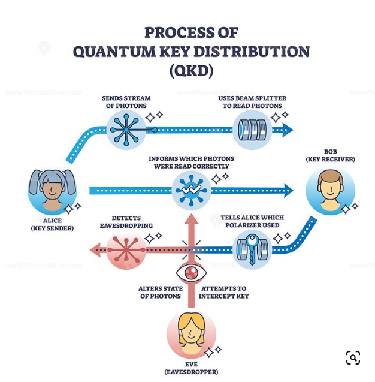

# QDK ( quantum key distribution)

La cryptographie joue un rôle crucial dans la sécurité des communications et des données. Elle se divise principalement en deux catégories : le chiffrement symétrique et le chiffrement asymétrique. Voici une explication des différences entre ces deux types de chiffrement.

## Chiffrement Symétrique

### Principe

Clé Unique : Utilise une seule clé pour le chiffrement et le déchiffrement des données. Cette clé doit être secrète et partagée entre les deux parties communicantes.

### Fonctionnement

Chiffrement : Le message en clair est chiffré à l'aide d'une clé secrète pour produire un texte chiffré.

Déchiffrement : Le texte chiffré est ensuite déchiffré par la même clé secrète pour retrouver le message en clair.

### Avantages

Rapidité : Généralement plus rapide que le chiffrement asymétrique, ce qui le rend adapté pour le chiffrement de grandes quantités de données.

Efficacité : Moins de ressources de calcul nécessaires.

### Inconvénients

Distribution des Clés : La clé doit être partagée en toute sécurité entre les deux parties, ce qui peut être difficile.

Sécurité : Si la clé est compromise, l'attaquant peut chiffrer et déchiffrer les messages.

Exemples
Algorithmes : AES (Advanced Encryption Standard), DES (Data Encryption Standard), 3DES (Triple DES).

## Chiffrement Asymétrique

### Principe

Paire de Clés : Utilise une paire de clés distinctes mais mathématiquement liées : une clé publique et une clé privée. La clé publique est accessible à tous, tandis que la clé privée est gardée secrète par le propriétaire.

### Fonctionnement

Chiffrement : Le message en clair est chiffré avec la clé publique du destinataire pour produire un texte chiffré.

Déchiffrement : Le texte chiffré est ensuite déchiffré par la clé privée correspondante pour retrouver le message en clair.

### Avantages

Distribution des Clés : Pas besoin de partager secrètement une clé, la clé publique peut être diffusée librement.

Sécurité : Si la clé privée reste secrète, le chiffrement reste sécurisé même si la clé publique est connue.

### Inconvénients

Lenteur : Généralement plus lent que le chiffrement symétrique, ce qui le rend moins adapté pour le chiffrement de grandes quantités de données.

Complexité : Plus de ressources de calcul nécessaires.

Exemples
Algorithmes : RSA (Rivest-Shamir-Adleman), ECC (Elliptic Curve Cryptography), DSA (Digital Signature Algorithm).

## Quantum Key Distribution, QKD

La distribution quantique de clés  est une technologie de cryptographie qui utilise les principes de la mécanique quantique pour permettre deux parties de générer une clé de cryptage commune et secrète, avec un niveau de sécurité inégalé. Voici un résumé des concepts clés de cette technologie :

### Principes de Base

Mécanique Quantique : QKD repose sur les propriétés fondamentales des particules quantiques, notamment les photons.

Intrication et Superposition : Utilisation des états quantiques des photons pour assurer la sécurité. Les photons peuvent être dans plusieurs états simultanément (superposition) et les états de deux photons peuvent être corrélés (intrication).

### Protocole BB84

Le protocole BB84, proposé par Charles Bennett et Gilles Brassard en 1984, est le protocole QKD le plus connu. Il fonctionne comme suit :

Étape 1 : Alice envoie à Bob une série de photons polarisés de manière aléatoire selon quatre bases possibles.

Étape 2 : Bob mesure la polarisation des photons en choisissant aléatoirement entre deux bases.

Étape 3 : Alice et Bob partagent publiquement les bases utilisées (pas les résultats).

Étape 4 : Ils conservent uniquement les mesures où ils ont utilisé la même base, créant ainsi une clé secrète commune.

### Sécurité Quantique

Théorème de non-clonage : Il est impossible de copier un état quantique inconnu, ce qui empêche un espion (Eve) de dupliquer les photons sans perturber leur état.

Détection d'interception : Toute tentative d'écoute clandestine modifie inévitablement les états quantiques, ce qui peut être détecté par Alice et Bob.

### Avantages

Sécurité Inconditionnelle : La sécurité de QKD repose sur les lois de la physique quantique, non sur des hypothèses mathématiques.
Détection de l'espionnage : Permet de détecter toute tentative d'interception grâce aux perturbations causées dans les états quantiques.

### Défis et Limites

Distance de Transmission : La transmission sur de longues distances reste un défi en raison de l'atténuation des signaux dans les fibres optiques et de la fragilité des états quantiques.

Infrastructure : Nécessite des équipements spécialisés et coûteux, limitant pour l'instant son adoption généralisée.

Vulnérabilités Pratiques : Bien que la théorie soit solide, les implémentations pratiques peuvent être vulnérables à des attaques spécifiques comme l'attaque par détection par bombardement.

### Applications

Communication Sécurisée : Utilisée pour protéger les communications sensibles, comme dans les secteurs gouvernementaux, militaires et financiers.

Réseaux Quantique : Développement de réseaux de communication quantique pour interconnecter divers nœuds de manière sécurisée.

## Conclusion

La distribution quantique de clés (QKD) représente une avancée majeure dans la cryptographie, offrant un niveau de sécurité basé sur les principes fondamentaux de la physique quantique. 
Bien que des défis subsistent pour sa mise en œuvre à grande échelle, QKD ouvre la voie à une communication ultra-sécurisée pour les applications critiques ainsi qu'une ouverture à un nouvel écosysteme technologique.

## Quelques informations

En europe, la société ID Quantique (IDQ), basée à Genève, en Suisse, qui fournit des systèmes de distribution de clés quantiques (QKD), un cryptage de réseau quantique sûr, des compteurs de photons uniques et des générateurs de nombres aléatoires matériels.

Il a été fondé en 2001 en tant que spin-off du Groupe de physique appliquée de l’Université de Genève.

https://en.wikipedia.org/wiki/ID_Quantique

En chine, le lancement d'un satellite en 2016 pour expérimenter la « QKD » à grande vitesse entre l’espace et le sol, et la faisabilité technique d’un réseau de communication à longue distance (plus de 1 000 km en liaison sol-sol et 500 km en liaison espace-sol) 

https://fr.wikipedia.org/wiki/QUESS